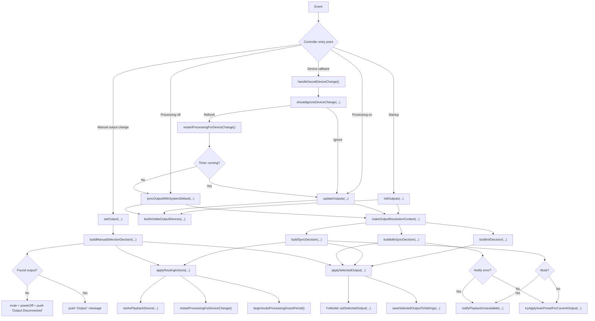
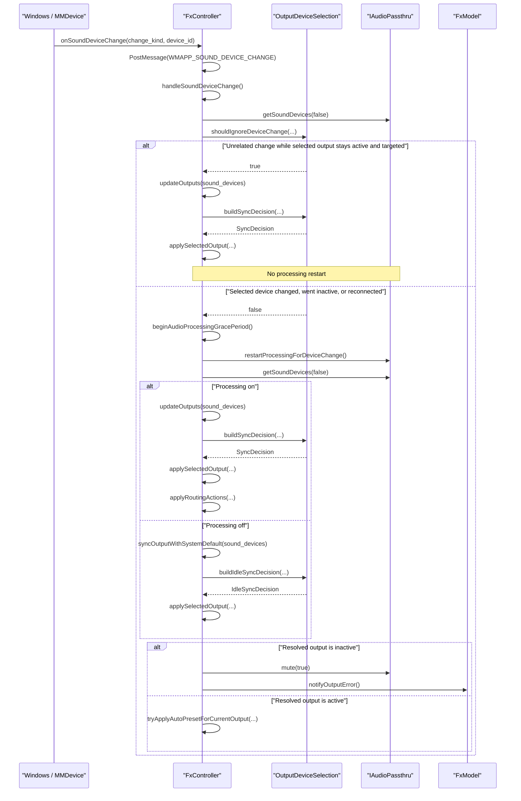

# Device Selection Flow

This note documents the extracted device-selection logic shared by:

- [`FxController.cpp`](/D:/Downloads/FxSound/fxsound-app/fxsound/Source/GUI/FxController.cpp)
- [`OutputDeviceSelection.h`](/D:/Downloads/FxSound/fxsound-app/fxsound/Source/GUI/OutputDeviceSelection.h)
- [`FxSoundCoreTests.cpp`](/D:/Downloads/FxSound/fxsound-app/tests/FxSoundCoreTests/FxSoundCoreTests.cpp)

## Entry Points

The controller has five main device-related entry points:

- `initOutputs(...)`
  Startup path.
- `setOutput(...)`
  Manual output selection from the UI.
- `updateOutputs(...)`
  Processing-on synchronization path.
- `syncOutputWithSystemDefault(...)`
  Processing-off synchronization path.
- `handleSoundDeviceChange()`
  Callback-driven device-change path.

## Pure Helper Mapping

The controller delegates state resolution to pure helpers in `OutputDeviceSelection.h`.

| Controller entry point | Pure helper(s) |
| --- | --- |
| `initOutputs(...)` | `buildVisibleOutputDevices`, `makeOutputResolutionContext`, `buildInitDecision` |
| `setOutput(...)` | `buildManualSelectionDecision`, `buildAutoPresetDecision` |
| `updateOutputs(...)` | `scanProcessingOutputs`, `buildVisibleOutputDevices`, `makeOutputResolutionContext`, `buildSyncDecision`, `buildAutoPresetDecision` |
| `syncOutputWithSystemDefault(...)` | `buildVisibleOutputDevices`, `makeOutputResolutionContext`, `buildIdleSyncDecision`, `buildAutoPresetDecision` |
| `handleSoundDeviceChange()` | `shouldIgnoreDeviceChange`, then `updateOutputs(...)` or `syncOutputWithSystemDefault(...)` |

## Main Flow

## Device-Change Sequence

## Scenario Summary

- Selected active output stays selected across unrelated device reconnects.
- Selected inactive output stays visible and muted.
- Reconnected selected output is matched by `device_id`, then `container_id`, then legacy name fallback.
- Manual selection of an active output can recover from a previously inactive selection.
- Mono outputs are excluded from priority building and manual selection.

## Test Coverage

`FxSoundCoreTests.cpp` covers both:

- pure helper decisions
- fake `IAudioPassthru` runtime scenarios

Important scenarios include:

- inactive selected output retention
- unselected inactive output removal
- reconnect with changed endpoint ID
- same-name different-container devices
- manual recovery after inactive selection
- idle sync without audio backend side effects
